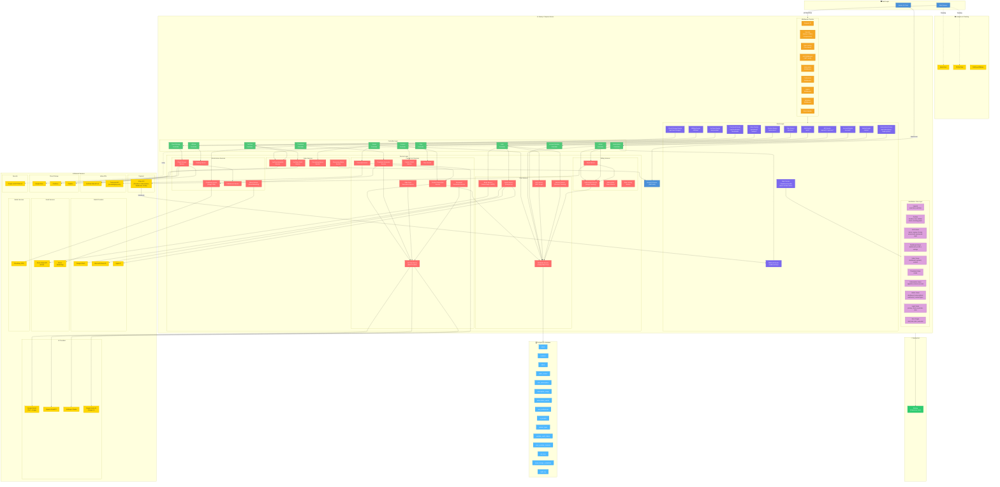

```mermaid
graph TB
    %% ============================================
    %% AmplifyContent.ai - Full Architecture Diagram
    %% ============================================

    %% --- Client Layer ---
    subgraph CLIENT["🖥️ Client Layer"]
        Browser["Web Browser"]
        SocketClient["Socket.IO Client"]
    end

    %% --- CDN & Analytics ---
    subgraph ANALYTICS["📊 Analytics & Tracking"]
        MetaPixel["Meta Pixel"]
        TikTokPixel["TikTok Pixel"]
        RefGrow["RefGrow Affiliates"]
    end

    %% --- Entry Point ---
    subgraph SERVER["⚙️ Node.js / Express Server"]

        %% --- Middleware Pipeline ---
        subgraph MIDDLEWARE["Middleware Pipeline"]
            direction LR
            ReqID["Request ID"]
            Security["Security\n(Helmet, CORS,\nCompression)"]
            RateLimit["Rate Limiting\n(Tier-Aware)"]
            AuthMW["Auth Middleware\n(JWT Verify)"]
            SubMW["Subscription\nMiddleware"]
            PrefMW["Preferences\nMiddleware"]
            AdminMW["Admin\nMiddleware"]
            ValidationMW["Validation\nMiddleware"]
            ErrorMW["Error Handler"]
        end

        %% --- Route Layer ---
        subgraph ROUTES["Route Layer"]
            AuthRoutes["Auth Routes\n/auth/*"]
            MainRoutes["Main Routes\n/ /dashboard /profile\n/about /contact /demo"]
            APIRoutes["API Routes\n/api/auth/* /api/user/*"]
            VideoRoutes["Video Routes\n/api/videos/*\n/videos/*"]
            YouTubeRoutes["YouTube Routes\n/api/youtube/*"]
            ContentRoutes["Content Routes\n/api/content/*"]
            ThumbnailRoutes["Thumbnail Routes\n/api/thumbnails/*\n/thumbnails"]
            ClipsRoutes["Clips Routes\n/api/clips/*"]
            SubRoutes["Subscription Routes\n/api/subscription/*\n/subscription/*"]
            WebhookRoutes["Webhook Routes\n/webhook/stripe"]
            AdminRoutes["Admin Routes\n/admin/*"]
            AffiliateRoutes["Affiliate Routes\n/affiliate/*"]
            CloudRoutes["Cloud Storage Routes\n/api/cloud-storage/*"]
            AcctRoutes["Account Routes\n/account/*"]
        end

        %% --- Controller Layer ---
        subgraph CONTROLLERS["Controller Layer"]
            AuthCtrl["Auth\nController"]
            VideosCtrl["Videos\nController"]
            YouTubeCtrl["YouTube\nController"]
            ContentCtrl["Content\nController"]
            ThumbnailCtrl["Thumbnail\nController"]
            ClipsCtrl["Clips\nController"]
            SubCtrl["Subscription\nController"]
            AdminCtrl["Admin\nController"]
            AffiliateCtrl["Affiliate\nController"]
            CloudCtrl["Cloud Storage\nController"]
            AcctCtrl["Account Deletion\nController"]
        end

        %% --- Service Layer ---
        subgraph SERVICES["Service Layer"]
            subgraph CORE_SVC["Core Services"]
                DatabaseSvc["Database Service\n(PostgreSQL Pool)"]
                AuthSvc["Auth Service\n(JWT, bcrypt)"]
                SessionSvc["Session Service\n(Duration Tracking)"]
                EmailSvc["Email Service\n(Azure Graph / SMTP)"]
                OAuthSvc["OAuth Service\n(Passport.js)"]
            end

            subgraph BILLING_SVC["Billing Services"]
                StripeSvc["Stripe Service"]
                SubscriptionSvc["Subscription Service\n(Usage Tracking)"]
                SubPlansSvc["Subscription\nPlans Service"]
                RateLimitSvc["Rate Limiting\nService"]
            end

            subgraph CONTENT_SVC["Content & AI Services"]
                AIChatSvc["AI Chat Service\n(Multi-Provider)"]
                ContentGenSvc["Content Generation\nService"]
                TranscriptSvc["Transcript Service"]
                ThumbnailGenSvc["Thumbnail Generator\nService"]
                SlideGenSvc["Slide Deck\nGeneration Service"]
                DocGenSvc["Document\nGeneration Service"]
                ContentSvc["Content CRUD\nService"]
                ClipsSvc["Clips Service"]
            end

            subgraph VIDEO_SVC["Video Services"]
                YTMetaSvc["YouTube Metadata\nService"]
                YTOAuthSvc["YouTube OAuth\nService"]
                ProcessQSvc["Processing Queue\nService"]
                ProcessStatusSvc["Processing Status\nService"]
            end

            subgraph INFRA_SVC["Infrastructure Services"]
                CloudinarySvc["Cloudinary Service\n(Image CDN)"]
                CloudStorageSvc["Cloud Storage\nService"]
                PrefSvc["Preferences Service"]
                TrackingSvc["Tracking Service"]
                BrevoSvc["Brevo Service\n(Email Marketing)"]
            end
        end

        %% --- View Layer ---
        subgraph VIEWS["Handlebars View Layer"]
            Layouts["Layouts\nmain.hbs | auth.hbs"]
            Partials["Partials\nheader | nav | sidebar\nfooter | tracking pixels"]
            AuthViews["Auth Views\nsignin | signup (3-step)\nsocial-verify | password reset"]
            DashViews["Dashboard Views\ndashboard | profile | settings"]
            VideoViews["Video Views\ndashboard | upload | content"]
            ThumbViews["Thumbnail Views\nstudio"]
            SubViews["Subscription Views\nupgrade | cancel | success"]
            AdminViews["Admin Views\ndashboard | subscriptions\nwebhooks | content-types"]
            LegalViews["Legal Views\nprivacy | terms | youtube-data"]
            ErrorViews["Error Pages\n404 | 500 | 501 | rate-limit"]
        end

        %% --- Real-time ---
        SocketIO["Socket.IO Server\n(JWT Auth)"]
    end

    %% --- Database Layer ---
    subgraph DATABASE["🗄️ PostgreSQL Database"]
        UsersTable["users"]
        SessionsTable["sessions"]
        VideosTable["videos"]
        VideoContentTable["video_content"]
        UserSubsTable["user_subscriptions"]
        SubUsageTable["subscription_usage"]
        SubEventsTable["subscription_events"]
        UserPrefsTable["user_preferences"]
        AiPromptsTable["ai_prompts"]
        ContentTypesTable["content_types"]
        YTTokensTable["youtube_oauth_tokens"]
        YTChannelsTable["user_youtube_channels"]
        ApiKeysTable["api_keys"]
        CloudCredTable["cloud_storage_credentials"]
        AuditTable["audit_log"]
    end

    %% --- External Services ---
    subgraph EXTERNAL["🌐 External Services"]
        subgraph AUTH_PROVIDERS["OAuth Providers"]
            Google["Google OAuth"]
            Microsoft["Microsoft Azure AD"]
            Apple["Apple ID"]
        end

        subgraph AI_PROVIDERS["AI Providers"]
            Gemini["Google Gemini\n(Text + Image)"]
            ChatGPT["OpenAI ChatGPT"]
            Claude["Anthropic Claude"]
            VertexAI["Google Vertex AI\n(Imagen 4)"]
        end

        subgraph PAYMENT["Payment"]
            StripeAPI["Stripe API\n(Checkout, Subscriptions,\nWebhooks, Portal)"]
        end

        subgraph VIDEO_API["Video APIs"]
            YouTubeAPI["YouTube Data API v3"]
            TranscriptAPI["Transcript API\n(io.ourailegacy.com)"]
        end

        subgraph CLOUD_STORAGE["Cloud Storage"]
            GoogleDrive["Google Drive"]
            OneDrive["OneDrive"]
            Dropbox["Dropbox"]
        end

        subgraph EMAIL_EXT["Email Services"]
            AzureGraph["Azure Graph API\n(Email)"]
            Brevo["Brevo\n(Marketing)"]
        end

        subgraph MEDIA["Media Services"]
            Cloudinary["Cloudinary CDN"]
        end

        subgraph SECURITY_EXT["Security"]
            reCAPTCHA["Google reCAPTCHA v3"]
        end
    end

    subgraph DEPLOY["🚀 Deployment"]
        Railway["Railway\n(Production Host)"]
    end

    %% ============================================
    %% CONNECTIONS
    %% ============================================

    %% Client to Server
    Browser -->|HTTP/HTTPS| MIDDLEWARE
    SocketClient <-->|WebSocket| SocketIO
    Browser -.->|Tracking| MetaPixel
    Browser -.->|Tracking| TikTokPixel

    %% Middleware to Routes
    MIDDLEWARE --> ROUTES

    %% Routes to Controllers
    AuthRoutes --> AuthCtrl
    MainRoutes --> VIEWS
    APIRoutes --> AuthCtrl
    VideoRoutes --> VideosCtrl
    YouTubeRoutes --> YouTubeCtrl
    ContentRoutes --> ContentCtrl
    ThumbnailRoutes --> ThumbnailCtrl
    ClipsRoutes --> ClipsCtrl
    SubRoutes --> SubCtrl
    WebhookRoutes --> SubCtrl
    AdminRoutes --> AdminCtrl
    AffiliateRoutes --> AffiliateCtrl
    CloudRoutes --> CloudCtrl
    AcctRoutes --> AcctCtrl

    %% Controllers to Services
    AuthCtrl --> AuthSvc
    AuthCtrl --> EmailSvc
    AuthCtrl --> SessionSvc
    AuthCtrl --> OAuthSvc

    VideosCtrl --> DatabaseSvc
    VideosCtrl --> ProcessQSvc
    VideosCtrl --> YTMetaSvc
    VideosCtrl --> TranscriptSvc

    YouTubeCtrl --> YTOAuthSvc
    YouTubeCtrl --> YTMetaSvc

    ContentCtrl --> ContentSvc
    ContentCtrl --> ContentGenSvc

    ThumbnailCtrl --> ThumbnailGenSvc
    ThumbnailCtrl --> CloudinarySvc

    ClipsCtrl --> ClipsSvc

    SubCtrl --> StripeSvc
    SubCtrl --> SubscriptionSvc

    AdminCtrl --> DatabaseSvc
    AdminCtrl --> SubscriptionSvc

    AffiliateCtrl --> TrackingSvc

    CloudCtrl --> CloudStorageSvc

    AcctCtrl --> DatabaseSvc

    %% Service to Service
    AuthSvc --> DatabaseSvc
    SessionSvc --> DatabaseSvc
    SubscriptionSvc --> DatabaseSvc
    ContentGenSvc --> AIChatSvc
    ContentGenSvc --> DatabaseSvc
    ThumbnailGenSvc --> AIChatSvc
    ThumbnailGenSvc --> CloudinarySvc
    TranscriptSvc --> ContentGenSvc
    ProcessStatusSvc --> SocketIO
    SlideGenSvc --> AIChatSvc
    DocGenSvc --> AIChatSvc
    CloudStorageSvc --> PrefSvc
    StripeSvc --> SubscriptionSvc

    %% Services to Database
    DatabaseSvc --> DATABASE

    %% Services to External
    OAuthSvc --> Google
    OAuthSvc --> Microsoft
    OAuthSvc --> Apple

    AIChatSvc --> Gemini
    AIChatSvc --> ChatGPT
    AIChatSvc --> Claude
    ThumbnailGenSvc --> VertexAI

    StripeSvc --> StripeAPI
    StripeAPI -->|Webhooks| WebhookRoutes

    YTMetaSvc --> YouTubeAPI
    YTOAuthSvc --> YouTubeAPI
    TranscriptSvc --> TranscriptAPI

    CloudStorageSvc --> GoogleDrive
    CloudStorageSvc --> OneDrive
    CloudStorageSvc --> Dropbox

    EmailSvc --> AzureGraph
    BrevoSvc --> Brevo

    CloudinarySvc --> Cloudinary

    AuthCtrl -.->|Verify| reCAPTCHA

    %% Deployment
    SERVER --> Railway

    %% ============================================
    %% STYLING
    %% ============================================
    classDef clientStyle fill:#4A90D9,stroke:#2C5F8A,color:#fff
    classDef middlewareStyle fill:#F5A623,stroke:#C47D15,color:#fff
    classDef routeStyle fill:#7B68EE,stroke:#5A4FCF,color:#fff
    classDef controllerStyle fill:#50C878,stroke:#3A9A5B,color:#fff
    classDef serviceStyle fill:#FF6B6B,stroke:#CC4444,color:#fff
    classDef viewStyle fill:#DDA0DD,stroke:#AA77AA,color:#333
    classDef dbStyle fill:#4DB8FF,stroke:#2A8FCC,color:#fff
    classDef externalStyle fill:#FFD700,stroke:#CCA300,color:#333
    classDef deployStyle fill:#2ECC71,stroke:#1FA855,color:#fff

    class Browser,SocketClient clientStyle
    class ReqID,Security,RateLimit,AuthMW,SubMW,PrefMW,AdminMW,ValidationMW,ErrorMW middlewareStyle
    class AuthRoutes,MainRoutes,APIRoutes,VideoRoutes,YouTubeRoutes,ContentRoutes,ThumbnailRoutes,ClipsRoutes,SubRoutes,WebhookRoutes,AdminRoutes,AffiliateRoutes,CloudRoutes,AcctRoutes routeStyle
    class AuthCtrl,VideosCtrl,YouTubeCtrl,ContentCtrl,ThumbnailCtrl,ClipsCtrl,SubCtrl,AdminCtrl,AffiliateCtrl,CloudCtrl,AcctCtrl controllerStyle
    class DatabaseSvc,AuthSvc,SessionSvc,EmailSvc,OAuthSvc,StripeSvc,SubscriptionSvc,SubPlansSvc,RateLimitSvc,AIChatSvc,ContentGenSvc,TranscriptSvc,ThumbnailGenSvc,SlideGenSvc,DocGenSvc,ContentSvc,ClipsSvc,YTMetaSvc,YTOAuthSvc,ProcessQSvc,ProcessStatusSvc,CloudinarySvc,CloudStorageSvc,PrefSvc,TrackingSvc,BrevoSvc serviceStyle
    class Layouts,Partials,AuthViews,DashViews,VideoViews,ThumbViews,SubViews,AdminViews,LegalViews,ErrorViews viewStyle
    class UsersTable,SessionsTable,VideosTable,VideoContentTable,UserSubsTable,SubUsageTable,SubEventsTable,UserPrefsTable,AiPromptsTable,ContentTypesTable,YTTokensTable,YTChannelsTable,ApiKeysTable,CloudCredTable,AuditTable dbStyle
    class Google,Microsoft,Apple,Gemini,ChatGPT,Claude,VertexAI,StripeAPI,YouTubeAPI,TranscriptAPI,GoogleDrive,OneDrive,Dropbox,AzureGraph,Brevo,Cloudinary,reCAPTCHA,MetaPixel,TikTokPixel,RefGrow externalStyle
    class Railway deployStyle
    class SocketIO clientStyle
```